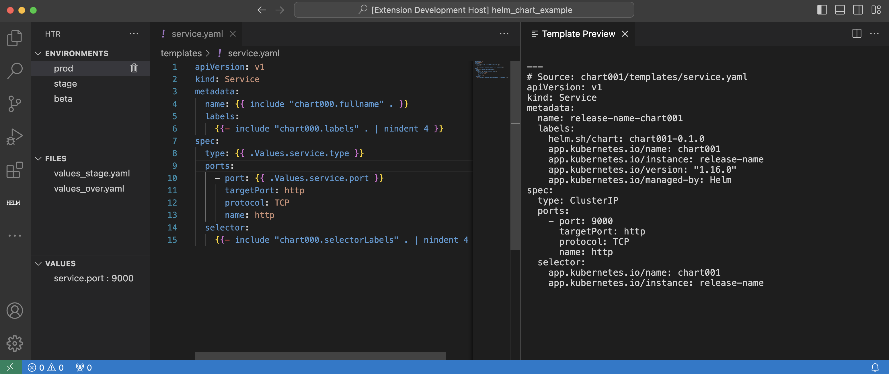

# HELM Template Renderer

This is the README for your extension "htr". After writing up a brief description, we recommend including the following sections.

## Features

Configure multiple deployment environments and see what your K8S object would look like if you are to publish it in the cluster.




## Requirements

helm, kubectl

## Extension Settings

VS Code settings through the `htr.environments` extension point.

For example:

```json
    "htr.environments": {
        "prod": {
            "files": [
                "values_prod.yaml",
                "values_over.yaml"
            ],
            "values": {
                "service.port": "9000"
            }
        }
    }
```

## Known Issues

1. Refresh data might look choppy

## Release Notes

### 1.0.0

Initial release with all functionalities done

